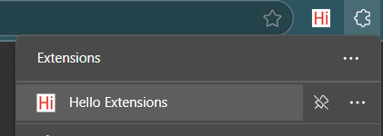
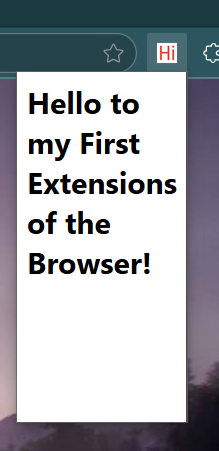

 1. This is my first browser extension, created as a learning project to understand the fundamentals of web extension development. 
 2. I followed guidance from Chrome for Developers documentation, building it step-by-step from the initial setup to the final console.log implementation.
 
### Extension Preview 1

3. Through this project, I learned about the manifest.json file, which serves as the configuration file for a browser extension. 
4. It defines important metadata, permissions, background scripts, and other settings that control how the extension behaves and interacts with the browser environment.

### Extension Preview 2

5. I gained hands-on experience building a browser extension, enhancing my understanding of web technologies, JSON configuration, and Chrome APIs.
